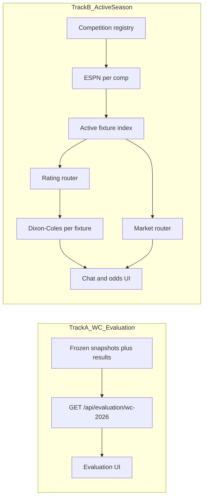

# Pundit: WC evaluation + season data plan

Phased transition from WC-only Pundit to **(A)** a frozen WC 2026 evaluation surface and **(B)** a competition-configured live pipeline for fixtures, club model, markets, and chat—without rewriting everything at once.

## Guiding principle

Build in this order: **data contract → flows → orchestration → UI/chat**. The LLM stays a **consumer** of cached grounding (`packages/api/src/services/ask.ts`); crons and `/ready` stay independent of Anthropic (`packages/api/src/index.ts`).

### Decision gates

Pick before or during Phase 1; defaults below are what the plan assumes.

| Decision | Recommended default | If you choose differently |
|----------|---------------------|---------------------------|
| First live competitions | Registry + **Premier League** enabled first | More leagues = more alias/market mapping in Phase 3 |
| WC backtest inputs | **Reconstruct** from dated Elo if no snapshots | If you have real snapshots, Phase 0 is faster and stronger |
| Club home advantage | Explicit **HFA** in Dixon-Coles for leagues | WC stays neutral (see `docs/how-it-works/the-model.md`) |

### Phase checklist

- [ ] **Phase 0** — `docs/architecture/season-data-spec.md` (entities, flows, first competition row)
- [ ] **Phase 1** — WC 2026 evaluation artifact + build script + `GET /api/evaluation/wc-2026` + web page
- [ ] **Phase 2** — Competition registry + multi-ESPN football-data + active-fixtures + matches API + fixtures UI
- [ ] **Phase 3** — Club Elo router, aliases, HFA, active-only model refresh; reframe `/model` page
- [ ] **Phase 4** — Parameterize fixture-market-sources; model-market-odds on active set; featured selector
- [ ] **Phase 5** — Generalize ask grounding/tiers and homepage suggestions; update docs

---

## Phase 0 — Data spec (no behavior change)

**Goal:** One document the team implements against; stops WC-specific assumptions from spreading.

**Deliverable:** `docs/architecture/season-data-spec.md` defining:

- **Entities:** `Competition`, `Fixture`, `FixtureModel`, `FixtureMarkets`, `EvaluationFixture`
- **Join key:** `competitionId + utcDate (or date bucket) + normalizedTeamPairKey` (reuse `packages/api/src/lib/team-names.ts`)
- **Per category:** fields, authority, refresh TTL, fallback (last-good), consumers
- **Flows A–E:** schedule, ratings, model compute, markets, WC evaluation (static only)

Update cross-links in `docs/how-it-works/data-sources.md` and `AGENTS.md` when the spec lands.

**Exit criteria:** Table of first competition(s) with ESPN paths, Elo TSV choice, market profile placeholders, HFA flag.

---

## Phase 1 — WC 2026 evaluation (Track A)

**Goal:** Show credible backtest on site **without** using live `model-data.ts` refresh (recalculated Elo is not look-ahead-free; see README/AGENTS).

**Backend**

1. **Artifact:** `packages/api/data/evaluation/wc-2026.json` — one row per WC fixture: kickoff, stage, teams, pre-kickoff `pHome/pDraw/pAway` (and optional totals/BTTS), actual result/winner, optional closing market fields if available later.
2. **Build script:** `packages/api/scripts/build-wc2026-evaluation.ts` — ingest snapshots **or** reconstruct using Elo as-of match date + `computeMatchModel` with neutral venues; stamp `method: "snapshot" | "reconstructed"` in metadata.
3. **Read-only route:** `GET /api/evaluation/wc-2026` — aggregates (Brier, log loss on 1X2, calibration buckets); no cron.

**Frontend**

4. New page `packages/web/src/app/evaluation/wc-2026/page.tsx` — headline metrics, fixture table (predicted vs actual), disclaimer for reconstructed rows.
5. Link from `packages/web/src/app/model/page.tsx` (“WC 2026 evaluation”).

**Tests:** Vitest on metric aggregation and JSON schema validation in `packages/api` only.

**Exit criteria:** Evaluation API returns stable metrics from committed artifact; UI loads without calling live model cron.

---

## Phase 2 — Competition registry + multi-competition fixtures

**Goal:** Backend knows **all relevant live/upcoming fixtures** for enabled competitions.

**Backend**

1. **Registry:** `packages/api/src/config/competitions.ts` — `id`, ESPN paths, `seasonDateRange`, `enabled`, `type`, `ratingProfile`, `marketProfile`, `homeFieldAdvantage`.
2. **Generalize** `packages/api/src/services/football-data.ts` — fetch per enabled competition; add `competitionId` to `FootballMatch`.
3. **Active fixture index:** `packages/api/src/services/active-fixtures.ts` — `SCHEDULED | IN_PLAY`, known teams, optional 14-day horizon.
4. **Routes:** extend `packages/api/src/routes/matches.ts` with `?competition=` and `/active`.

**Frontend**

5. Evolve `packages/web/src/app/fixtures/page.tsx` — competition tabs, “this week” default.

**Exit criteria:** `/ready` passes when one comp fails; active list works for enabled league(s).

---

## Phase 3 — Club ratings + match model for active fixtures

**Goal:** Model probs for **active** club fixtures.

**Backend**

1. **Rating router:** extend `packages/api/src/services/elo-ratings.ts` — national + club TSVs per profile.
2. **Aliases:** expand `packages/api/src/lib/team-names.ts` for clubs.
3. **Split model refresh** in `packages/api/src/services/model-data.ts` — live path for active fixtures; WC sim only for tournament type or frozen.
4. **HFA** in `packages/api/src/services/dixon-coles.ts` when configured.

**Frontend**

6. Reframe `packages/web/src/app/model/page.tsx` — active comps default; WC → evaluation link.

**Exit criteria:** Active league fixtures have 1X2 in API; tests cover HFA and aliases.

---

## Phase 4 — Market router tied to active fixtures

**Goal:** Odds for the **active list**, not WC semis only.

**Backend**

1. `model-market-odds.ts` — input = active fixtures.
2. Parameterize `fixture-market-sources.ts` — Stake tournament, Kalshi series per `marketProfile`.
3. Generalize `featured-fixtures.ts` → featured selector for homepage.

**Frontend**

4. `home-chat.tsx` suggestions from featured active fixtures.

**Exit criteria:** At least one league shows model vs ≥1 market source; `/ready` coverage reflects active set.

---

## Phase 5 — Chat grounding + product polish

**Backend**

1. Update `packages/api/src/services/ask.ts` — tier-1 from active/featured; tier-2 from standings; club HFA in prompts.

**Docs / ops**

3. Refresh model/data-sources docs and README.

**Exit criteria:** Chat grounds club matches correctly; WC still reachable via evaluation/history.

---

## Deferred

- Ongoing immutable snapshot storage for club season (WC evaluation artifact only in Phase 1).
- Paid unified odds APIs unless ESPN + three sources are insufficient.
- League-wide Monte Carlo title models until Phase 3 is stable.
- Web test infrastructure (per AGENTS).

---

## Execution order and risk

| Order | Phase | Risk | Mitigation |
|-------|-------|------|------------|
| 1 | 0 + 1 | Wrong backtest story | Label reconstruction; separate API from live model |
| 2 | 2 | ESPN / pre-season sparsity | One league; `enabled` flags |
| 3 | 3 | Name mapping | Aliases + Vitest early |
| 4 | 4 | Thin market coverage | Partial UI; `/ready` warnings |
| 5 | 5 | Prompt regressions | Extend `ask.test.ts` |

**Phases 0–1 ship value on their own** (evaluation on site). **Phase 2** unlocks the rest without wiring every market on day one.
